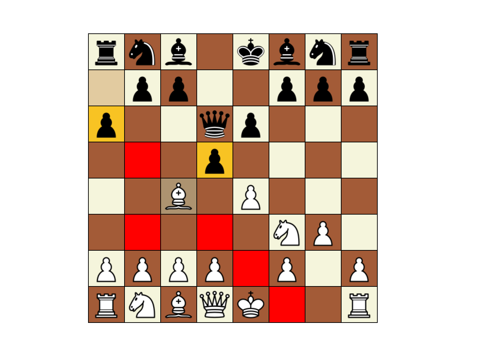
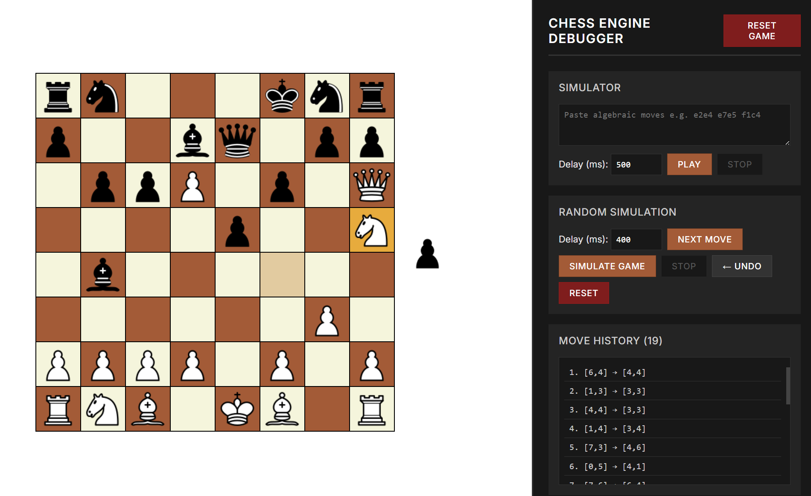
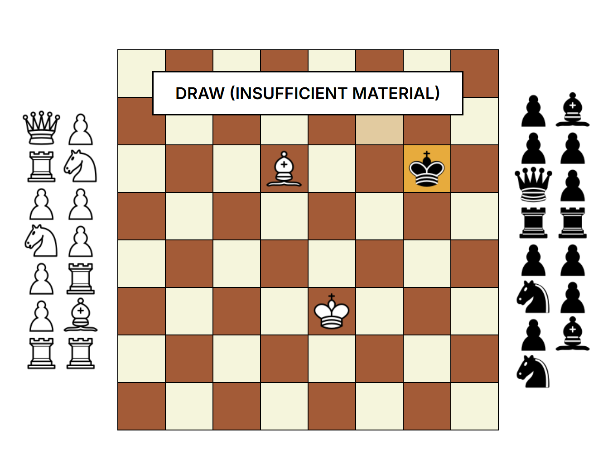

# Chess Simulator

Website: https://chess-simulator-gilt.vercel.app

## Overview
A high-performance web-based chess simulator built with Angular 19. This project features a robust implementation of FIDE chess rules, optimized with a modern reactive architecture using Angular Signals and a decoupled service-based logic.

  
   
  
  

## Logic and Validation
The simulator is engineered for reliability and precision, featuring a comprehensive logic engine built entirely in TypeScript:
- **Service-Oriented Architecture:** Core game mechanics are decoupled from the UI, managed by specialized services for Board state, Game flow, and Player management.
- **Reactive State:** Uses Angular Signals to ensure efficient, real-time board updates and state synchronization.
- **Exhaustive Testing:** Validated by a suite of **50 automated match tests** covering complex scenarios, including various checkmate patterns, castling edge cases, and endgame rules.

## Key Features
- **Complete FIDE Ruleset:** 
  - **Standard Play:** Full validation for all piece movements and captures.
  - **Special Moves:** Implementation of Castling, En Passant, and Pawn Promotion (auto-queen).
- **Advanced Endgame States:**
  - **Check & Checkmate:** Precise detection of threats and immediate endgame resolution.
  - **Stalemate & Draws:** Automatic detection of draws by stalemate, 50-move rule, and insufficient material.
- **Game History:** Tracking of moves and state progression throughout the match.

## Technical Stack
- **Frontend Framework:** Angular 19+ (Signals, Standalone Components, RxJS)
- **Programming Language:** TypeScript

## Project Structure
- `/client/src/app/services`: Orchestration of game logic and board state.
- `/client/src/app/models`: Object-oriented definitions for Pieces, Squares, and Moves.
- `/client/src/app/chess-board`: Reactive UI component for the interactive board.
- `/server`: Python Flask backend for advanced simulation logging and AI integration.

## Local Installation and Execution
1. Clone the repository and navigate to the project directory.
2. Navigate to the client folder: `cd client`
3. Install dependencies: `npm install`
4. Launch the development server: `npm start`
5. The application will be available on `http://localhost:4200`.
