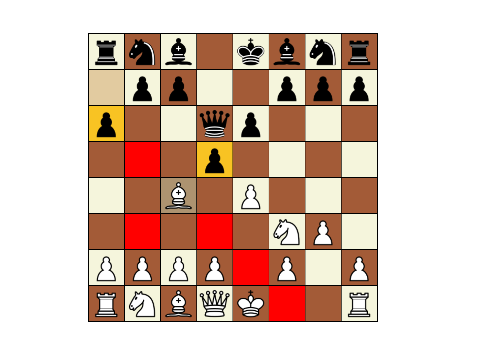
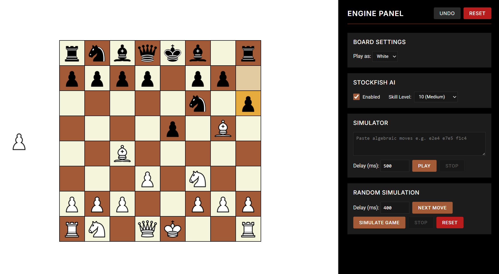
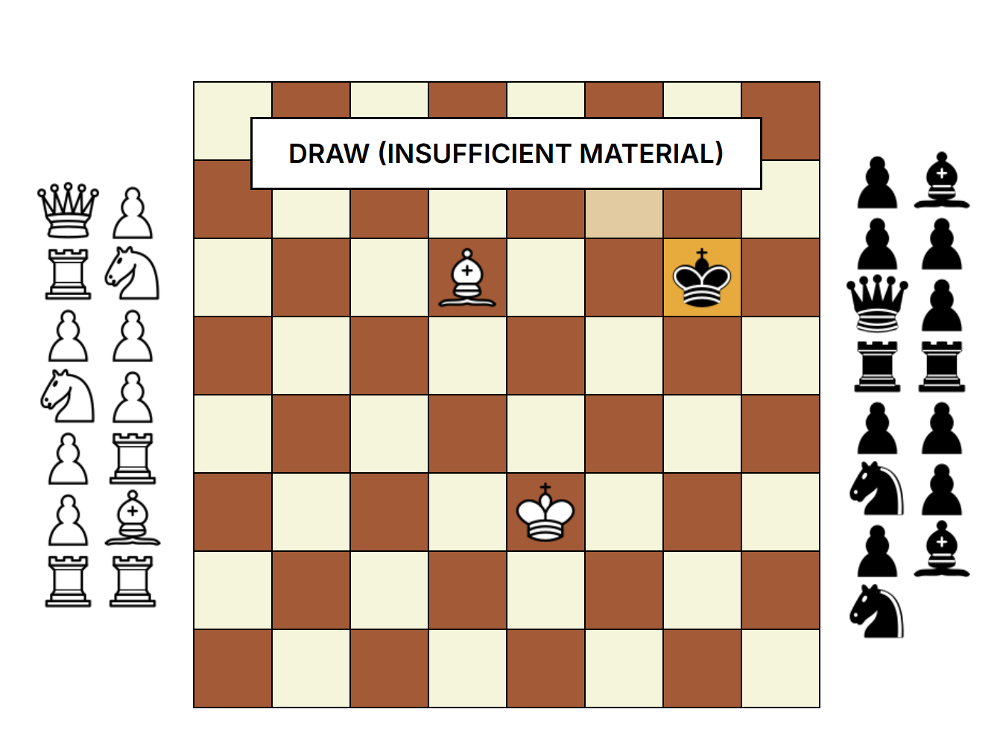

# Chess Simulator

Website: https://chess-simulator-gilt.vercel.app

## Overview
A high-performance web-based chess simulator built with Angular 19. This project features a robust implementation of FIDE chess rules, optimized with a modern reactive architecture using Angular Signals and a decoupled service-based logic.

## Logic and Validation
The simulator is engineered for reliability and precision, featuring a comprehensive logic engine built entirely in TypeScript:
- **Service-Oriented Architecture:** Core game mechanics are decoupled from the UI, managed by specialized services for Board state, Game flow, and Player management.
- **Reactive State:** Uses Angular Signals to ensure efficient, real-time board updates and state synchronization.
- **Exhaustive Testing:** Validated by a suite of **50 automated match tests** covering complex scenarios, including various checkmate patterns, castling edge cases, and endgame rules.

## Key Features
- **Stockfish 18 WASM Integration:** Play against a world-class engine running entirely in your browser. By utilizing **WebAssembly**, the simulator offers zero-latency AI moves without external API dependencies or rate limits.
- **Difficulty Control:** Adjust the challenge using a granular **Skill Level (0-20)** system, ranging from beginner-friendly to grandmaster-level performance.
- **Complete FIDE Ruleset:** 
  - **Standard Play:** Full validation for all piece movements and captures.
  - **Special Moves:** Implementation of Castling, En Passant, and Pawn Promotion.
- **Advanced Endgame States:**
  - **Check & Checkmate:** Precise detection of threats and immediate endgame resolution.
  - **Stalemate & Draws:** Automatic detection of draws by stalemate, 50-move rule, and insufficient material.
- **Game History & Analysis:** Real-time evaluation parsing, move history tracking, and a dedicated simulator to replay or test specific move sequences.
- **Privacy & Performance:** No moves are sent to external servers; all AI calculations happen locally using high-performance Web Workers.

## Screenshots

  
   
  
  

## Technical Stack
- **Frontend Framework:** Angular 19+ (Signals, Standalone Components, RxJS)
- **Programming Language:** TypeScript

